<p align="center">
  
</p>

<p align="center">
  
</p>

<h1 align="center">Hi, I'm Zhuanz</h1>

<p align="center">
  <a href="https://git.io/typing-svg">
    
  </a>
</p>

<p align="center">
  
  
  
  
</p>

<br>

<div align="center">

```text
     ideas  ->  structure  ->  tools  ->  memory  ->  momentum
```

</div>

<p align="center">
  
</p>

<br>

<p align="center">
  
  
</p>

<p align="center">
  
  
</p>

<br>

<p align="center">
  
</p>

<p align="center">
  
</p>
