<p align="center">
  
</p>

<h1 align="center">Zhuanz</h1>

<p align="center">
  <samp>
    AI workflow builder · writing-system tinkerer · research-tool maker
  </samp>
</p>

<p align="center">
  <kbd>AI</kbd>
  <kbd>Writing Systems</kbd>
  <kbd>Research</kbd>
  <kbd>Automation</kbd>
  <kbd>Long Ideas</kbd>
  <kbd>Memory</kbd>
</p>

<br>

<div align="center">

```text
╭────────────────────────────────────────────────────────────────╮
│                                                                │
│     messy idea  ──▶  clear structure  ──▶  useful system       │
│                                                                │
│          imagination          memory          momentum          │
│                                                                │
╰────────────────────────────────────────────────────────────────╯
```

</div>

<table align="center">
  <tr>
    <td align="center" width="170">
      <b>01</b><br>
      <samp>Imagine</samp>
    </td>
    <td align="center" width="170">
      <b>02</b><br>
      <samp>Structure</samp>
    </td>
    <td align="center" width="170">
      <b>03</b><br>
      <samp>Automate</samp>
    </td>
    <td align="center" width="170">
      <b>04</b><br>
      <samp>Remember</samp>
    </td>
    <td align="center" width="170">
      <b>05</b><br>
      <samp>Refine</samp>
    </td>
  </tr>
</table>

<br>

<h2 align="center">Signal Field</h2>

<table align="center">
  <tr>
    <td align="center" width="260">
      <b>AI Workflows</b><br><br>
      <samp>agents · prompts · tool use</samp>
    </td>
    <td align="center" width="260">
      <b>Writing Systems</b><br><br>
      <samp>bibles · outlines · continuity</samp>
    </td>
  </tr>
  <tr>
    <td align="center" width="260">
      <b>Research Tools</b><br><br>
      <samp>papers · figures · experiments</samp>
    </td>
    <td align="center" width="260">
      <b>Small Automations</b><br><br>
      <samp>scripts · docs · daily flow</samp>
    </td>
  </tr>
</table>

<br>

<h2 align="center">Tool Words</h2>

<p align="center">
  <code>Python</code>
  <code>JavaScript</code>
  <code>TypeScript</code>
  <code>Node.js</code>
  <code>HTML</code>
  <code>CSS</code>
  <code>Markdown</code>
  <code>LaTeX</code>
  <code>Git</code>
  <code>GitHub</code>
</p>

<br>

<table align="center">
  <tr>
    <td align="center" width="220">
      <samp>mode</samp><br>
      <b>curious</b>
    </td>
    <td align="center" width="220">
      <samp>texture</samp><br>
      <b>calm</b>
    </td>
    <td align="center" width="220">
      <samp>output</samp><br>
      <b>usable</b>
    </td>
  </tr>
</table>

<br>

<div align="center">

```text
╔════════════════════════════════════════════════════════════════╗
║   stay curious  ·  keep memory in files  ·  make it useful   ║
╚════════════════════════════════════════════════════════════════╝
```

</div>

<p align="center">
  <samp>
    building calm systems for noisy creative and research work
  </samp>
</p>

<p align="center">
  
</p>
