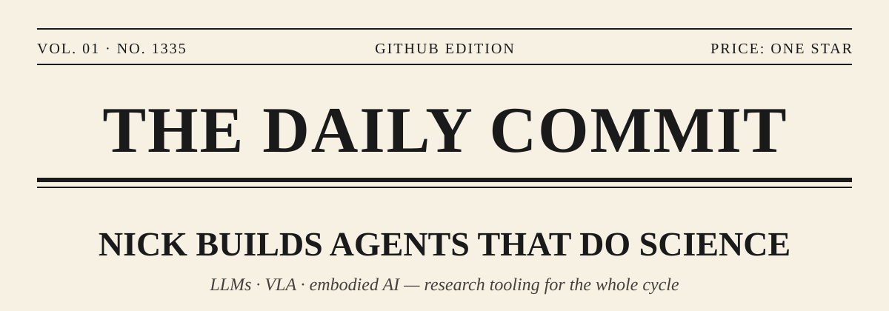
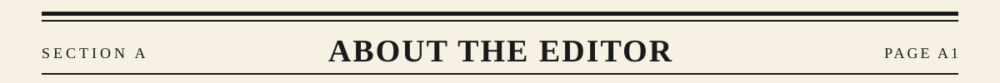
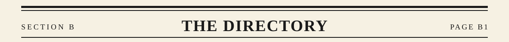
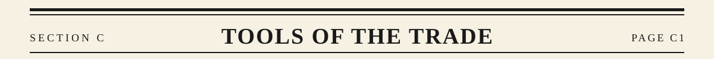
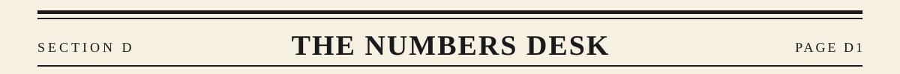
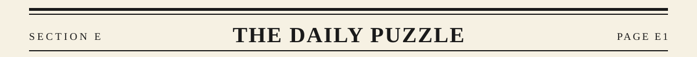
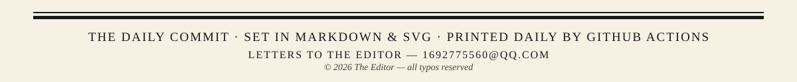

<div align="center">



<p>
  
  <a href="https://github.com/1692775560?tab=followers"></a>
  <a href="https://github.com/1692775560?tab=repositories"></a>
  
</p>

<samp><b>IN TODAY'S PAPER</b> — A. ABOUT THE EDITOR · B. THE DIRECTORY · C. TOOLS OF THE TRADE · D. THE NUMBERS DESK · E. THE DAILY PUZZLE</samp>

</div>

<br>




```yaml
name: Nick
research: [AI Agents for Science, LLMs, VLA & Embodied AI]
focus: [Agentic Workflows, Research Tooling, Writing Systems]
currently_building: Mimir — a workbench for the whole research cycle
```

**GITHUB, Sept. 2** — The editor of this page works on **agentic scientific research**:
agents that read papers, run experiments and close the loop. The desk follows
**LLMs** (agents, prompts, tool use, reasoning) and **VLA models & embodied AI** —
from perception and language to action. On the side, the editor builds research
tools that turn messy ideas into usable systems, and tinkers with writing systems
for long-form creation.

> ### “messy idea → clear structure → useful system”
> — *from the editor's desk*

<br clear="right"/>



<samp>SELECTED WORK · FILED UNDER: AGENTS / RESEARCH / TOOLING / NOVELS</samp>

> ### LEAD STORY — [deepseek_project](https://github.com/1692775560/deepseek_project) &nbsp; 
> An AI-powered WeChat assistant built on DeepSeek — the most-starred project on this desk.

<br>

<table>
  <tr>
    <td width="50%" valign="top">
      <b>02 · <a href="https://github.com/1692775560/PaperClaw">PaperClaw</a></b>
      <br>
      High-agency AI automation for academic research — LLM decision engine + skill plugins + memory.
    </td>
    <td width="50%" valign="top">
      <b>03 · <a href="https://github.com/1692775560/Mimir">Mimir</a></b>
      <br>
      All-in-one research workbench: LaTeX live-compile, arXiv management, experiment tracking, GPU SSH orchestration.
    </td>
  </tr>
  <tr>
    <td width="50%" valign="top">
      <b>04 · <a href="https://github.com/1692775560/API-2-MCP">API-2-MCP</a></b>
      <br>
      Production-ready MCP servers from OpenAPI specs — turn REST APIs into tools for Claude Code &amp; Codex.
    </td>
    <td width="50%" valign="top">
      <b>05 · <a href="https://github.com/1692775560/AMU">AMU</a></b>
      <br>
      Attention-based mRNA transformer predicting melanoma immunotherapy response.
    </td>
  </tr>
  <tr>
    <td width="50%" valign="top">
      <b>06 · <a href="https://github.com/1692775560/Q_System">Q_System</a></b>
      <br>
      AI quantitative trading system powered by DeepSeek &amp; Gate.io.
    </td>
    <td width="50%" valign="top">
      <b>07 · <a href="https://github.com/1692775560/eko-agent-github">eko-agent-github</a></b>
      <br>
      Discover trending GitHub repos and <i>why</i> they're popular, powered by Eko AI.
    </td>
  </tr>
  <tr>
    <td width="50%" valign="top">
      <b>08 · <a href="https://github.com/1692775560/fanqie-novel-skills">fanqie-novel-skills</a></b>
      <br>
      Category-aware agent skills for Chinese web-novel creation.
    </td>
    <td width="50%" valign="top">
      <b>… · <a href="https://github.com/1692775560?tab=repositories">more from the archives</a></b><br>
      The full catalogue, filed at the repositories desk.
    </td>
  </tr>
</table>



<div align="center">

<a href="https://skillicons.dev">
  
</a>

</div>



<div align="center">


<br>


<br><br>


<br><br>

<samp><b>MARKET CHART</b> — STAR HISTORY, AS REPORTED BY THE EXCHANGE</samp>


</div>



<div align="center">

<picture>
  <source media="(prefers-color-scheme: dark)" srcset="https://raw.githubusercontent.com/1692775560/1692775560/output/github-contribution-grid-snake-dark.svg"/>
  <source media="(prefers-color-scheme: light)" srcset="https://raw.githubusercontent.com/1692775560/1692775560/output/github-contribution-grid-snake.svg"/>
  
</picture>

<samp>OUR RESIDENT SNAKE EATS ONE COMMIT PER DAY · SOLUTION IN TOMORROW'S EDITION</samp>

</div>

<br>


