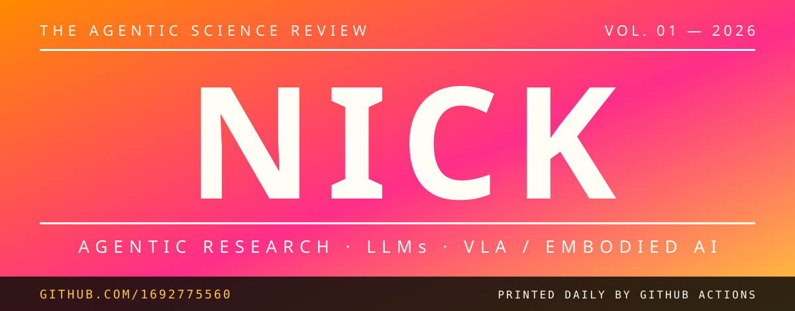

<div align="center">



<a href="https://git.io/typing-svg">
  
</a>

<p>
  
  <a href="https://github.com/1692775560?tab=followers"></a>
  <a href="https://github.com/1692775560?tab=repositories"></a>
  
</p>

<samp><b>IN THIS ISSUE</b> — 01 ABOUT · 02 SELECTED WORK · 03 TOOLBOX · 04 NUMBERS · 05 FOOTPRINT</samp>

</div>


<br>

# 01 — ABOUT


```yaml
name: Nick
research: [AI Agents for Science, LLMs, VLA & Embodied AI]
focus: [Agentic Workflows, Research Tooling, Writing Systems]
currently_building: Mimir — a workbench for the whole research cycle
philosophy: stay curious · keep memory in files · make it useful
```

- 🔬 Working on **agentic scientific research** — agents that read papers, run experiments and close the loop
- 🧠 Into **LLMs** — agents, prompts, tool use, reasoning
- 🦾 Exploring **VLA models & embodied AI** — from perception and language to action
- 🛠️ Building **research tools** that turn messy ideas into usable systems
- ✍️ Tinkering with **writing systems** for long-form creation

> ### “messy idea → clear structure → useful system”
> — *the editorial line of this page*

<br clear="right"/>


<br>

# 02 — SELECTED WORK

<div align="center">

| № | Project | Description | Stars |
|:---:|:---:|---|:---:|
| 01 | 🤖 [**deepseek_project**](https://github.com/1692775560/deepseek_project) | AI-powered WeChat assistant built on DeepSeek |  |
| 02 | 📚 [**PaperClaw**](https://github.com/1692775560/PaperClaw) | High-agency AI automation system for academic research — LLM decision engine + skill plugins + memory |  |
| 03 | 🔬 [**Mimir**](https://github.com/1692775560/Mimir) | All-in-one research workbench: LaTeX live-compile, arXiv management, experiment tracking, GPU SSH orchestration |  |
| 04 | 🔌 [**API-2-MCP**](https://github.com/1692775560/API-2-MCP) | Production-ready MCP servers from OpenAPI specs — turn REST APIs into tools for Claude Code & Codex |  |
| 05 | 🧬 [**AMU**](https://github.com/1692775560/AMU) | Attention-based mRNA transformer predicting melanoma immunotherapy response |  |
| 06 | 📈 [**Q_System**](https://github.com/1692775560/Q_System) | AI quantitative trading system powered by DeepSeek & Gate.io |  |
| 07 | 🔍 [**eko-agent-github**](https://github.com/1692775560/eko-agent-github) | Discover trending GitHub repos and *why* they're popular, powered by Eko AI |  |
| 08 | ✍️ [**fanqie-novel-skills**](https://github.com/1692775560/fanqie-novel-skills) | Category-aware agent skills for Chinese web-novel creation |  |

</div>


<br>

# 03 — TOOLBOX

<div align="center">

<a href="https://skillicons.dev">
  
</a>

</div>


<br>

# 04 — NUMBERS

<div align="center">


<br>


<br><br>


<br><br>


</div>


<br>

# 05 — FOOTPRINT

<div align="center">

<picture>
  <source media="(prefers-color-scheme: dark)" srcset="https://raw.githubusercontent.com/1692775560/1692775560/output/github-contribution-grid-snake-dark.svg"/>
  <source media="(prefers-color-scheme: light)" srcset="https://raw.githubusercontent.com/1692775560/1692775560/output/github-contribution-grid-snake.svg"/>
  
</picture>

</div>

<br>

<div align="center">

```text
╔══════════════════════════════════════════════════════════════════╗
║    stay curious  ·  keep memory in files  ·  make it useful      ║
╚══════════════════════════════════════════════════════════════════╝
```

<i>building calm systems for noisy creative and research work</i>

<br>

<samp>THE AGENTIC SCIENCE REVIEW · VOL. 01 · SET IN MARKDOWN &amp; SVG · PRINTED ON GITHUB</samp>

</div>


